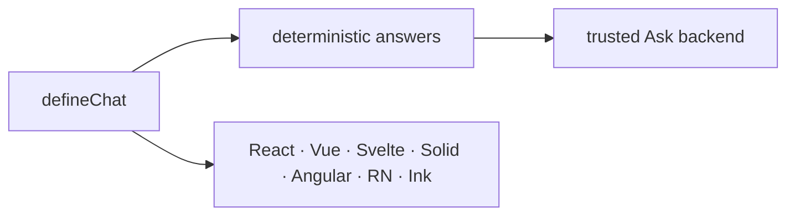

<p align="center">
  
</p>

<h1 align="center">AgentsKit Chat</h1>

<p align="center">
  <strong>Profile:</strong> <code>top-level-repository</code>
</p>

<p align="center">
  <strong>One agent experience. Every interface.</strong>
</p>

<p align="center">
  <a href="https://github.com/AgentsKit-io/agentskit-chat/actions/workflows/ci.yml"></a>
  <a href="./LICENSE"></a>
  <a href="https://www.npmjs.com/package/@agentskit/chat"></a>
</p>

Cross-framework application framework for building interactive agent experiences on top of [AgentsKit](https://github.com/AgentsKit-io/agentskit). Define chat behavior once, answer exact local facts before any backend call, and render the same definition through native React, React Native, Ink, Vue, Svelte, Solid, and Angular shells.

AgentsKit remains the controller/runtime substrate. AgentsKit Chat composes typed definitions, deterministic routes, policy, protocol envelopes, Web-standard handlers, and renderer bindings into full interactive applications.

## Verified proof

Repository claims are derived from canonical evidence and checked in CI:

| Surface | Current proof |
|---|---:|
| Public npm packages | 2 |
| Native renderers | 7 |
| Standard components | 12 |
| Conformance requirements | 12 |
| Renderer quick starts | 7 |
| Example applications | 6 |
| Architecture ADRs | 33 |
| Agent handoffs | 28 |

Counts live in [`ecosystem-claims.json`](./ecosystem-claims.json), generated by [`scripts/gen-ecosystem-claims.mjs`](./scripts/gen-ecosystem-claims.mjs). The [conformance matrix](./docs/conformance/matrix.generated.md), [launch checklist](./docs/releases/launch-checklist.md), and [dogfood record](./docs/dogfood/registry-playbook.md) provide release and adoption evidence.

<!-- readme-command:verify-readme -->
```bash
node examples/verify-readme.mjs
```

## Quick start

Scaffold a React project from the published CLI, then verify the README claim ledger locally:

<!-- readme-command:init-react -->
```bash
pnpm dlx @agentskit/chat-cli@0.4.1 init my-chat --renderer react --yes
```

<!-- readme-example:init-react -->
```bash
pnpm dlx @agentskit/chat-cli@0.4.1 init my-chat --renderer react --yes
```

Continue with the [seven renderer quick starts](./docs/getting-started/index.mdx), [API reference](./docs/api-reference.mdx), and [deployment modes](./docs/deployment.mdx).




## Maturity and compatibility

AgentsKit Chat `0.4.1` ships as two public npm packages with provenance: `@agentskit/chat` and `@agentskit/chat-cli`. Protocol, server, devtools, and renderer APIs are versioned subpaths of `@agentskit/chat`; React and Ink can also render host-owned controlled sessions without creating a second controller. Patch releases preserve protocol meaning, component contracts, and persisted session compatibility. See [stability and upgrades](./docs/releases/stability.md), the [0.4 release notes](./docs/releases/v0.4.0.md), the [0.3 package migration](./docs/releases/migration-to-0.3.md), and the [compatibility matrix](./docs/releases/compatibility.md).

- Node.js 22 in CI; Node.js 24 in release workflows
- TypeScript strict mode across packages
- Peer ranges for `@agentskit/core`, renderer bindings, and `@agentskit/memory` are authoritative in each published manifest

## Documentation

- [Get started in all seven renderers](./docs/getting-started/index.mdx)
- [Hosted and self-hosted Ask backend](./docs/backend.md)
- [Deterministic answer protocol](./docs/protocol/deterministic-answers.md)
- [DOM renderer parity examples](./docs/examples/dom-renderer-parity.md)
- [Architecture overview](./docs/architecture/overview.md)
- [ADR-0002: upstream-first adoption](./docs/architecture/adrs/0002-upstream-first-no-reimplementation.md)
- [Agent documentation index](./docs/for-agents/index.md)

## Examples

```bash
pnpm --filter @agentskit/chat-example-react dev
pnpm --filter @agentskit/chat-example-vue dev
pnpm --filter @agentskit/chat-example-svelte dev
pnpm --filter @agentskit/chat-example-solid dev
```

React, Vue, Svelte, and Solid share definitions from `@agentskit/chat-example-shared`. React Native and Ink keep dedicated proof apps.

## Contributing

Read [CONTRIBUTING.md](./CONTRIBUTING.md) and [AGENTS.md](./AGENTS.md) before editing. Use doc-bridge for ownership routing:

```bash
pnpm docs:bridge:index
pnpm docs:bridge:query ownership <id> --agent
pnpm docs:bridge:gate
```

**Tags:** `agentskit-chat`, `agentskit`, `typescript`, `cross-framework`, `chat-ui`, `deterministic-answers`

## AgentsKit ecosystem

| Product | Relationship |
|---|---|
| [AgentsKit](https://github.com/AgentsKit-io/agentskit) | Controller, adapters, memory, eval, and framework bindings consumed upstream |
| [Registry](https://registry.agentskit.io) | Dogfoods the consolidated protocol and Ask surface |
| [AgentsKit Chat](https://chat.agentskit.io/docs) | This repository: the shared application layer for conversational surfaces |
| [Playbook](https://playbook.agentskit.io) | Dogfoods deterministic local answers and shared Ask integration |
| [Doc Bridge](https://agentskit-io.github.io/doc-bridge/) | Indexes ownership, gates, and agent handoffs for this repository |
| [Code Review](https://github.com/AgentsKit-io/code-review-cli#readme) | Reviews changes before merge with the model already in your workflow |
| [AKOS](https://akos.agentskit.io) | Adds enterprise orchestration, governance, and production controls |

## License

[MIT](./LICENSE)
