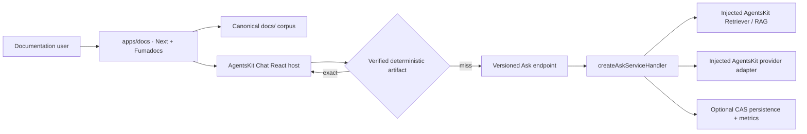

# ADR-0027: Fumadocs site is a first-class AgentsKit Chat dogfood host

- Status: Proposed
- Date: 2026-07-14
- Issue: [#71](https://github.com/AgentsKit-io/agentskit-chat/issues/71)

## Context

AgentsKit Chat already has canonical Markdown documentation, a generated Doc
Bridge corpus, deterministic answer artifacts, a trusted Ask backend contract,
and native React rendering. A public documentation property must compose those
surfaces without introducing a second documentation corpus, chat controller,
retrieval engine, protocol, or browser memory implementation.

The site must remain useful without provider credentials, distinguish shipped
and unavailable capabilities honestly, and prove that hosted and self-hosted
backends use the same public request and response contracts.

## Decision

Create `apps/docs` as one Next.js App Router application using Fumadocs. It is a
modular monolith and the only new deployable unit.

The existing repository `docs/` tree remains the canonical human corpus.
Fumadocs reads that tree directly and uses committed navigation metadata; the
site does not maintain copied prose under a second content directory. Raw
Markdown and `llms.txt` routes expose the same canonical or generated sources.

The interactive documentation assistant is a normal React host of the public
framework:

1. `@agentskit/chat-protocol` validates the generated local knowledge artifact.
2. `@agentskit/chat` composes deterministic resolution, the Ask adapter, and
   browser session memory.
3. `@agentskit/chat-react` renders the shared definition through the upstream
   `@agentskit/react` binding.
4. Exact known questions resolve from the verified local artifact before any
   network request.
5. Misses use the versioned Ask contract. The default endpoint is same-origin;
   operators may select the hosted endpoint without changing the definition.

The self-hosted Next route is built with `createAskServiceHandler` from
`@agentskit/chat-server`. Retrieval, generation, persistence, rate limiting,
and metrics remain injected host adapters. Production adapters must compose
published AgentsKit RAG, memory, and provider packages. If required adapters
are absent, the route returns an explicit unavailable response; it never
fabricates an answer or citation. Tests inject bounded public fixtures through
the same factory rather than adding a test-only wire protocol.

Fumadocs search is documentation navigation only. It is not used as a substitute
for AgentsKit retrieval in the Ask backend.

## Containers



## Site modules

```text
apps/docs
├── app/                 Fumadocs pages, search/raw/llms routes, Ask route
├── components/          site shell and AgentsKit Chat presentation slots
├── lib/source.ts        Fumadocs loader over canonical docs/
├── lib/chat/            definition, verified artifact and backend factory
└── tests/               contract, integration, accessibility and E2E evidence
```

## Alternatives considered

1. Copy selected Markdown into `apps/docs/content/docs` — rejected because
   content and maturity statements would drift from the repository docs.
2. Embed a host-specific chat widget — rejected because it would not prove the
   released definition, protocol, memory, server, and renderer packages.
3. Use Fumadocs search as semantic retrieval — rejected because navigation
   search does not satisfy the AgentsKit RAG ownership boundary.
4. Require a hosted backend — rejected because the public server contract must
   remain self-hostable and testable without external credentials.
5. Add a separate documentation repository — rejected because it would weaken
   changeset, compatibility, Doc Bridge, and code-to-doc freshness gates.

## Consequences

- Documentation and the site share one source of truth.
- The site is deployable independently while remaining inside release and CI
  governance.
- Known questions remain fast and available without provider credentials.
- Reasoning answers require an explicitly configured backend and safe citations.
- The site adds Next/Fumadocs build cost to the monorepo.
- Provider and vector-store choices remain deployment concerns rather than new
  AgentsKit Chat abstractions.

## Guardrails

- No chat controller, renderer, Ask decoder, browser memory, retrieval engine,
  provider transport, vector store, or Fumadocs search protocol is recreated.
- All external/model/server boundaries use existing runtime schemas.
- No provider secret enters client bundles or public diagnostics.
- Maturity labels derive from released package and compatibility evidence.
- Visual customization uses renderer slots and semantic tokens; portable
  behavior remains in the shared definition.
- Any missing generic primitive is fixed and released in AgentsKit first.

## Acceptance

This ADR remains Proposed until the HITL review for #71 approves the maturity
copy, dogfood claim, and hosted/self-hosted deployment posture.
