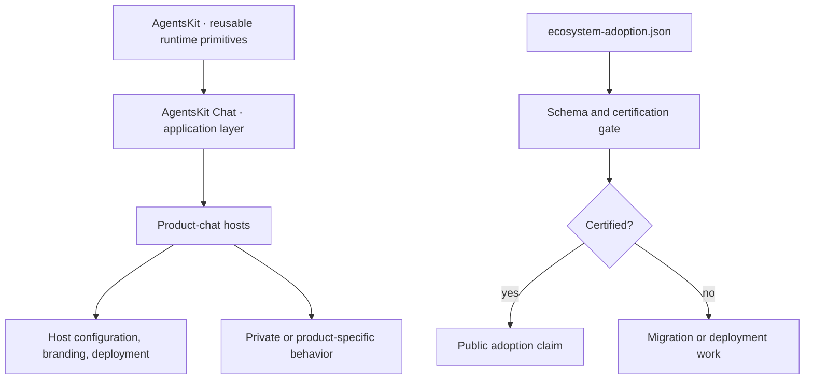

# ADR-0030: Certify ecosystem product chats through one application layer

- **Status:** Proposed
- **Date:** 2026-07-14
- **Issue:** [#100](https://github.com/AgentsKit-io/agentskit-chat/issues/100)
- **Parent PRD:** [#99](https://github.com/AgentsKit-io/agentskit-chat/issues/99)

## Context

AgentsKit Chat 0.3.0 consolidates the public application framework into
`@agentskit/chat` and `@agentskit/chat-cli`. AgentsKit Docs, the deployed
Registry, and Playbook consume that graph, while other active consumers still
use legacy package names, lack production deployment, or retain host-specific
product chat surfaces. Low-level AgentsKit binding examples also look like chat
applications even though their purpose is to teach the underlying binding.

Issue closure alone cannot support an ecosystem-wide adoption claim. The claim
needs one definition of a product chat, bounded treatment of private consumers,
and evidence that fails closed when a version, migration, CI run, or production
smoke is missing.

## Decision

AgentsKit remains the runtime substrate. It owns controllers, lifecycle,
framework bindings, adapters, tools, memory, RAG, replay, eval, and reusable
agent primitives. AgentsKit Chat is the single application layer for product
chats. It owns portable application definitions, deterministic routes, policy
composition, component manifests, session envelopes, protocol, server seams,
and native renderer shells. Hosts own configuration, content, branding,
deployment, and business-specific actions or state machines.

A **product chat** is an end-user conversational surface that composes
application behavior, presentation, and a runtime or deterministic answer
source. Every declared product chat must consume `@agentskit/chat` or a
supported subpath at the exact certified version. Direct use of an AgentsKit
binding is allowed only in an explicitly classified **low-level binding
example** whose purpose is to teach that primitive. Such examples are excluded
from product-chat adoption totals and may not be presented as framework hosts.

The repository commits `ecosystem-adoption.json` as the public convergence
ledger. A strict runtime schema verifies:

- the fixed set of declared consumers and supported repositories;
- product, infrastructure, and low-level-example classification;
- exact framework version and supported import paths;
- remaining legacy standalone packages;
- public CI and production evidence; and
- aggregate private attestations without URLs or implementation fields.

`certified` is derived from evidence, not issue state. A public product chat
requires the exact version, no legacy package, consolidated consumption,
passing CI with an HTTPS evidence URL, and a passing production smoke URL. A
private product chat requires the same contract plus a bounded private-audit
attestation; its source, topology, identifiers, behavior, and business rules
remain outside public artifacts.

The ledger is an audited baseline, not a live network monitor. Cross-repository
certification resolves evidence and updates the ledger through reviewed PRs.
Repository CI validates schema and internal consistency without depending on
network availability.

## System boundary

## Non-functional requirements

- The gate is deterministic, offline, and adds no production dependency.
- Exact-version rollback remains available per consumer until final
  certification.
- Existing renderer bundle, accessibility, conformance, and performance budgets
  remain unchanged.
- Public evidence contains no provider secret, user content, private source,
  internal topology, identifier, or business rule.
- Missing evidence is incomplete, never implicitly successful.

## Alternatives considered

1. **Infer adoption from closed issues.** Rejected because issue state does not
   prove the current default branch, package graph, deployment, or production
   behavior.
2. **Require every educational chat example to use AgentsKit Chat.** Rejected
   because it would prevent AgentsKit from teaching its lower-level bindings
   and would blur the framework/runtime boundary.
3. **Publish the private AKOS inventory.** Rejected because convergence requires
   contract evidence, not disclosure of private behavior or topology.
4. **Run network checks in every repository test.** Rejected because ordinary CI
   must remain deterministic; network resolution belongs to the final
   cross-repository certification workflow.
5. **Allow semver ranges in the ledger.** Rejected because a range does not prove
   which artifact produced the evidence.

## Consequences

### Positive

- “Powered by AgentsKit Chat” becomes measurable and reviewable.
- Low-level examples remain valid without weakening product adoption claims.
- Private consumers can prove conformance without exposing internal logic.
- Missing migrations and deployments remain visible instead of being hidden by
  a closed milestone.

### Negative

- Adding or removing a declared consumer requires a schema and ADR review.
- Evidence updates add cross-repository maintenance work.
- Broad promotion remains blocked until every required product chat is
  certified.

### Neutral

- The ledger records external repositories but does not fetch or mutate them.
- Existing host deployment and monitoring systems remain host-owned.

## Failure modes and mitigations

| Failure | Mitigation |
|---|---|
| Stale successful URL | Final certification resolves URLs and records a new audited date. |
| Legacy package reintroduced | Consumer repository gates plus this ledger keep certification false. |
| Private detail enters public evidence | Private records accept only fixed aggregate attestation values. |
| Workspace dogfood misrepresented as npm | Consumption mode is explicit and workspace is restricted to the framework-owned portal. |
| Missing generic primitive discovered | Migration stops and the primitive is fixed and released in its upstream owner first. |

## Acceptance

This ADR remains Proposed until HITL review approves the product-chat definition,
the low-level-example exception, the private-attestation boundary, and the rule
that broad promotion requires every declared product chat to be certified.

## References

- [ADR-0002: upstream-first and no reimplementation](./0002-upstream-first-no-reimplementation.md)
- [ADR-0027: Fumadocs framework dogfood](./0027-fumadocs-framework-dogfood.md)
- [ADR-0028: public package consolidation](./0028-public-package-consolidation.md)
- [ADR-0029: renderers as Chat subpaths](./0029-renderers-as-chat-subpaths.md)
- [0.3 migration guide](../../releases/migration-to-0.3.md)
- [Ecosystem adoption ledger](../../dogfood/ecosystem-adoption.md)
