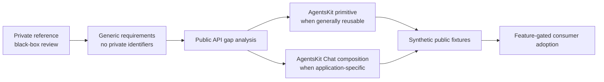

# Private-reference extraction guardrails

**Status:** Draft for human review in [#28](https://github.com/AgentsKit-io/agentskit-chat/issues/28)

## Purpose

AgentsKit Chat may use a private product as black-box dogfood evidence while evolving public, reusable framework capabilities. The private product is not a public specification or a source donor.

Public work may record only:

- generic user-facing requirements;
- public AgentsKit and AgentsKit Chat API gaps;
- framework ownership decisions;
- interoperability, security, recovery, and compatibility criteria;
- synthetic examples and conformance fixtures created for the public project.

Public work must not record:

- private repository paths, package names, symbols, schemas, prompts, or source excerpts;
- private product flows, states, catalogs, policies, rules, or operational topology;
- private business logic, authorization models, integrations, data shapes, or implementation details;
- screenshots, fixtures, logs, or telemetry derived from the private product;
- claims that allow the private architecture to be reconstructed from public artifacts.

## Extraction workflow

## Public capability candidates

The public framework may evolve capabilities already consistent with its public product direction:

- versioned structured application turns;
- deterministic application routing before model dispatch;
- registered components and typed action proposals;
- session metadata, replay, recovery, and semantic fallback;
- optional serializable interaction-state composition;
- cross-framework behavior and native presentation parity;
- bounded evidence, diagnostics, and confidence assertions.

These candidates are requirements, not descriptions of the private implementation. Each requires its own public contract, synthetic tests, and upstream-adoption record.

## Ownership boundary

| Concern | Public owner |
|---|---|
| Controller lifecycle, model/tool loop, memory, retrieval, replay primitives, framework bindings | AgentsKit |
| Application turn protocol, deterministic application policy, component/action manifests, renderer parity | AgentsKit Chat |
| Product data, permissions, business rules, integrations, execution authority, and private UX | Consuming host |

## Migration entrance criteria

Consumer adoption may begin only after:

- public ADRs are approved without relying on private implementation details;
- every generic upstream gap is released by AgentsKit first;
- public synthetic fixtures prove framework behavior independently;
- feature flags and rollback preserve one authority and one execution path;
- browser, native, terminal, offline, malformed-output, cancellation, and provider-failure behavior is verified where applicable;
- a privacy review confirms that the public diff and reachable Git history contain no private implementation disclosure.

## Review rule

If a public requirement cannot be justified without describing private implementation details, it is not ready for publication. Keep the evidence private and publish only the independently specified capability after review.
