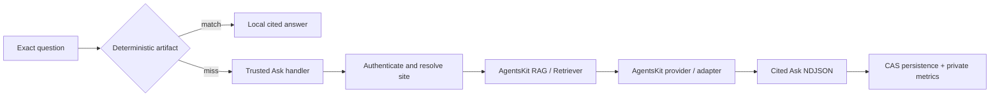

# Hosted and self-hosted Ask backend

`createAskServiceHandler` is the production boundary for semantic questions that the deterministic plane cannot answer. It accepts one public protocol in every deployment and derives all authority server-side.



## Shared production factory

```ts
import { createAskServiceHandler } from '@agentskit/chat-server'

export const ask = createAskServiceHandler({
  authenticate: (request, signal) => auth.verify(request, signal),
  resolveSite: (identity, signal) => siteRegistry.resolve(identity.siteId, signal),
  resolveSubjectId: identity => identity.subjectId,
  retrievers: {
    local: { retrieve: input => localRag.retrieve(input) },
    federated: { retrieve: input => federatedRag.retrieve(input) },
  },
  generator: providerGenerator,
  sessionStore: durableCasStore,
  rateLimit: input => limiter.consume(input.site.siteId, input.subjectId, input.signal),
  onMetric: metric => telemetry.record(metric),
})
```

`localRag` and `federatedRag` are adapters around the public AgentsKit RAG/Retriever APIs. `providerGenerator` delegates generation and usage to an AgentsKit provider. The handler never implements embeddings, vector search, ranking, model transport, authentication, or storage.

## Hosted route

Web-standard platforms mount the shared factory directly:

```ts
import { ask } from './ask-backend.js'

export const POST = ask
```

## Self-hosted Node route

The Node bridge only translates HTTP to Web standards. It does not change the public request or response:

```ts
import { createServer } from 'node:http'
import { ask } from './ask-backend.js'

createServer(async (incoming, outgoing) => {
  const disconnected = new AbortController()
  incoming.once('aborted', () => disconnected.abort())
  outgoing.once('close', () => disconnected.abort())
  const chunks: Buffer[] = []
  for await (const chunk of incoming) chunks.push(Buffer.from(chunk))
  const response = await ask(new Request(`http://localhost${incoming.url ?? '/'}`, {
    method: incoming.method,
    headers: incoming.headers as HeadersInit,
    signal: disconnected.signal,
    ...(chunks.length === 0 ? {} : { body: Buffer.concat(chunks) }),
  }))
  outgoing.writeHead(response.status, Object.fromEntries(response.headers))
  if (response.body === null) return outgoing.end()
  for await (const chunk of response.body) outgoing.write(chunk)
  outgoing.end()
}).listen(3000)
```

The package integration tests execute both local and federated configurations through the same handler contract and prove identical events through a direct hosted invocation and a real self-hosted Node streaming bridge.

## Site configuration

Each trusted site record declares:

- stable site and assistant identities;
- suggestions shown by the host;
- one authorized corpus and its `local` or `federated` mode;
- registered components and actions;
- request, retrieval, and generation deadlines;
- maximum citation count;
- required or disabled persistence.

The browser cannot select this record. Legacy `corpus` and `persona` query parameters must equal the resolved record or the server returns `ASK_FORBIDDEN`.

## Persistence and replay

Sites using `persistence.mode: required` must inject a CAS store. Keys contain trusted site and subject IDs plus the validated application session ID. `load` returns a bounded revisioned record; `save` receives the expected revision. A concurrent mutation produces `ASK_PERSISTENCE_CONFLICT` and increments the conflict metric. Provider details and user content never enter the diagnostic.

## Operational gates

- Apply rate limits before parsing the request body.
- Keep provider secrets and corpus credentials only in injected server adapters.
- Propagate `AbortSignal` into authentication, rate limiting, retrieval, generation, and persistence.
- Require at least one safe citation. Unsupported schemes, credentials in URLs, and malformed sources are dropped.
- Export every backend metric, including zeros. `stream.snapshots` is zero for Ask because its public stream contains events rather than turn snapshots.
- Alert on error, cancellation, conflict, and rate-limit ratios; establish latency/token/cost baselines before tuning.
- Never log request bodies, prompts, generated answers, retrieved excerpts, credentials, subject IDs, or session IDs.

See [ADR-0026](./architecture/adrs/0026-trusted-ask-backend-vertical.md) for the accepted boundary.
