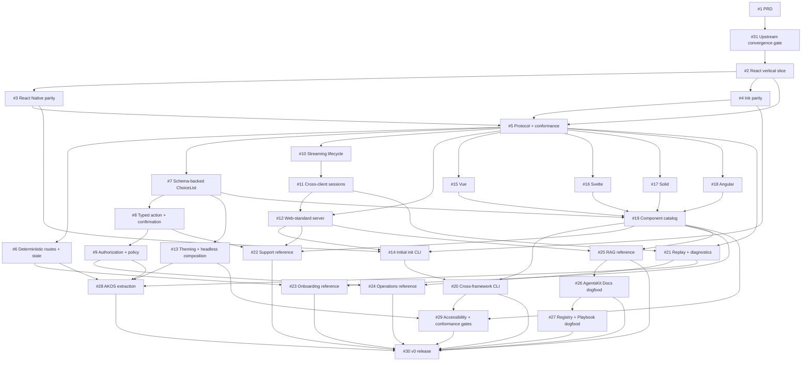

# AgentsKit Chat v0 roadmap

The parent product requirement is [GitHub issue #1](https://github.com/AgentsKit-io/agentskit-chat/issues/1). Every child issue includes user stories, acceptance criteria, real dependency links, a test plan, documentation impact, delivery mode, and an explicit Definition of Done.

## Milestone

[v0 — Cross-framework foundation](https://github.com/AgentsKit-io/agentskit-chat/milestone/1)

## Delivery graph

The diagram highlights the critical path. Individual issue bodies are authoritative for the complete dependency set.

## Architecture proof

- [#31 Upstream convergence and ownership gate](https://github.com/AgentsKit-io/agentskit-chat/issues/31) — HITL, blocks implementation
- [#2 React hello-world vertical slice](https://github.com/AgentsKit-io/agentskit-chat/issues/2) — AFK
- [#3 React Native parity](https://github.com/AgentsKit-io/agentskit-chat/issues/3) — AFK
- [#4 Ink parity](https://github.com/AgentsKit-io/agentskit-chat/issues/4) — AFK
- [#5 Versioned protocol and conformance fixtures](https://github.com/AgentsKit-io/agentskit-chat/issues/5) — HITL

## Core interactive behavior

- [#6 Deterministic routes and conversational state](https://github.com/AgentsKit-io/agentskit-chat/issues/6)
- [#7 Schema-backed ChoiceList](https://github.com/AgentsKit-io/agentskit-chat/issues/7)
- [#8 Typed action with confirmation](https://github.com/AgentsKit-io/agentskit-chat/issues/8)
- [#9 Authorization and action policy](https://github.com/AgentsKit-io/agentskit-chat/issues/9)
- [#10 Streaming lifecycle parity](https://github.com/AgentsKit-io/agentskit-chat/issues/10)
- [#11 Persistent cross-client sessions](https://github.com/AgentsKit-io/agentskit-chat/issues/11)
- [#12 Web-standard server handler](https://github.com/AgentsKit-io/agentskit-chat/issues/12)
- [#13 Semantic theming and headless composition](https://github.com/AgentsKit-io/agentskit-chat/issues/13) — HITL

## Renderer and CLI expansion

- [#14 Initial `init` for React, React Native, and Ink](https://github.com/AgentsKit-io/agentskit-chat/issues/14)
- [#15 Vue renderer](https://github.com/AgentsKit-io/agentskit-chat/issues/15)
- [#16 Svelte renderer](https://github.com/AgentsKit-io/agentskit-chat/issues/16)
- [#17 Solid renderer](https://github.com/AgentsKit-io/agentskit-chat/issues/17)
- [#18 Angular renderer](https://github.com/AgentsKit-io/agentskit-chat/issues/18)
- [#19 Cross-framework component catalog](https://github.com/AgentsKit-io/agentskit-chat/issues/19)
- [#20 Cross-framework CLI and component generator](https://github.com/AgentsKit-io/agentskit-chat/issues/20)
- [#21 Replay and parity diagnostics](https://github.com/AgentsKit-io/agentskit-chat/issues/21)

## Reference applications

- [#22 Support application](https://github.com/AgentsKit-io/agentskit-chat/issues/22)
- [#23 Deterministic onboarding](https://github.com/AgentsKit-io/agentskit-chat/issues/23)
- [#24 Policy-protected operations](https://github.com/AgentsKit-io/agentskit-chat/issues/24)
- [#25 Cited RAG application](https://github.com/AgentsKit-io/agentskit-chat/issues/25)

## Dogfood and release

- [#26 AgentsKit Docs migration](https://github.com/AgentsKit-io/agentskit-chat/issues/26)
- [#27 Registry and Playbook migration](https://github.com/AgentsKit-io/agentskit-chat/issues/27)
- [#28 AKOS generic copilot extraction](https://github.com/AgentsKit-io/agentskit-chat/issues/28) — HITL
- [#29 Accessibility and platform-conformance gates](https://github.com/AgentsKit-io/agentskit-chat/issues/29)
- [#30 v0 documentation and release](https://github.com/AgentsKit-io/agentskit-chat/issues/30) — HITL

## Parallel work

After #5 is accepted, #6, #7, #10, #15, #16, #17, and #18 have independent ownership and may proceed concurrently. Renderer work shares protocol fixtures but must not alter the accepted protocol without a new ADR and coordinated compatibility review.
