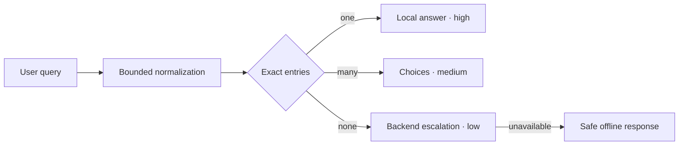

# Deterministic answer protocol

The deterministic answer plane resolves declared exact facts before the backend. It is intentionally small: commands, package identities, navigation, contribution links, ecosystem relationships, restricted FAQs, and document titles may be local. Reasoning, comparisons, recommendations, unknown input, and multi-cause diagnosis escalate.

> This v1 contract is accepted in [ADR-0024](../architecture/adrs/0024-deterministic-answer-plane.md), with HITL approval recorded on 2026-07-13.

## Host integration

Decode the site-owned configuration and immutable artifact at the trust boundary, verify its expected hash, then compose it with the existing backend adapter:

```ts
import { createAskAdapter, createDeterministicAnswerAdapter, defineChat } from '@agentskit/chat'
import {
  decodeDeterministicSiteConfig,
  decodeLocalKnowledgeArtifact,
} from '@agentskit/chat-protocol'

const site = decodeDeterministicSiteConfig(siteConfigJson)
if (!site.ok) throw new Error(site.diagnostic.message)

const artifact = decodeLocalKnowledgeArtifact(artifactJson, {
  expectedContentHash: site.value.artifact.contentHash,
})
if (!artifact.ok) throw new Error(artifact.diagnostic.message)

const definition = defineChat({
  id: site.value.siteId,
  chat: {
    adapter: createDeterministicAnswerAdapter({
      artifact: artifact.value,
      fallback: createAskAdapter({ corpus: 'docs' }),
    }),
  },
})
```

The host owns loading, cache headers, and SHA-256 calculation. The decoder checks that the artifact's declared content hash matches the trusted site configuration; it does not treat a self-declared hash as cryptographic verification.

## Exact means exact

Both artifact producers and clients use `normalizeKnowledgeKey`: Unicode NFKC, trim, whitespace collapse, and stable case folding. After that normalization, the whole query must equal a declared value. The runtime performs no token, prefix, fuzzy, embedding, semantic, or model match.



An expired artifact always escalates, even when its index contains an exact match. A corrupt or hash-mismatched artifact is rejected before resolver construction. If no backend is configured, an unknown question produces a safe offline escalation instead of an invented answer.

## Unified response envelope

Every response uses `agentskit.chat.answer` v1 and one outcome:

| Outcome | Confidence | Provenance | Use |
|---|---|---|---|
| `answer` | `high/exact` or `high/backend` | local artifact entry or backend | One authoritative result |
| `choices` | `medium/ambiguous` | local artifact entries | More than one exact result |
| `escalation` | `low` with matching reason | none | Miss, stale, corrupt, or offline |

Local adapter chunks expose the validated envelope at `chunk.metadata.answer`. Backend fallback receives the low-confidence envelope at `request.context.metadata['agentskit.chat.escalation']`; its original stream and cancellation are not wrapped or consumed.

## Artifact limits and compatibility

Artifacts are capped at 512 KiB, 1,024 entries, and 16 aliases per entry. Queries are capped at 512 characters. Links accept safe root-relative paths or credential-free HTTP(S). Diagnostics are stable and never echo the rejected payload or raw Zod issues.

Optional additive v1 fields are compatible. A new required field, normalization rule, outcome, or confidence meaning requires v2, migration fixtures, and a new ADR. Conformance fixtures cover exact match, ambiguity, miss, stale, corrupt, hash mismatch, backend provenance, and offline behavior through `@agentskit/chat-protocol/fixtures`.
