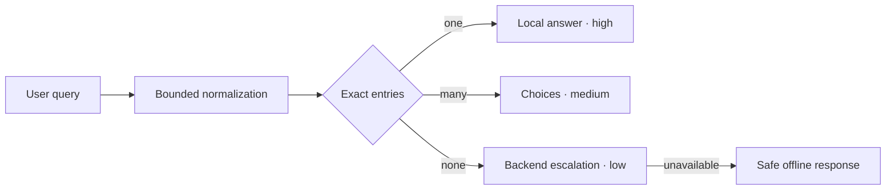

# Deterministic answer protocol

The deterministic answer plane resolves declared exact facts before the backend. It is intentionally small: commands, package identities, navigation, contribution links, ecosystem relationships, restricted FAQs, and document titles may be local. Reasoning, comparisons, recommendations, unknown input, and multi-cause diagnosis escalate.

> This v1 contract is accepted in [ADR-0024](../architecture/adrs/0024-deterministic-answer-plane.md), with HITL approval recorded on 2026-07-13.

## Host integration

Decode the site-owned configuration and immutable artifact at the trust boundary, verify its expected hash, then compose it with the existing backend adapter:

```ts
import {
  ChoiceListComponent,
  SourceListComponent,
  createAskAdapter,
  createDeterministicAnswerAdapter,
  defineChat,
  defineComponentManifest,
} from '@agentskit/chat'
import {
  decodeDeterministicSiteConfig,
  verifyLocalKnowledgeArtifact,
} from '@agentskit/chat/protocol'

const site = decodeDeterministicSiteConfig(siteConfigJson)
if (!site.ok) throw new Error(site.diagnostic.message)

const artifact = await verifyLocalKnowledgeArtifact(artifactJson, {
  expectedContentHash: site.value.artifact.contentHash,
  expectedSiteId: site.value.siteId,
})

// A corrupt local artifact must not prevent the backend chat from starting.
const localArtifact = artifact.ok ? artifact.value : null
const fallback = site.value.fallback.mode === 'backend'
  ? createAskAdapter({ corpus: 'docs' })
  : undefined

const adapter = createDeterministicAnswerAdapter({
  artifact: localArtifact,
  expectedContentHash: site.value.artifact.contentHash,
  expectedSiteId: site.value.siteId,
  fallbackMode: site.value.fallback.mode,
  fallback,
  backend: { provider: 'ask' },
})

const definition = defineChat({
  id: site.value.siteId,
  components: defineComponentManifest([ChoiceListComponent, SourceListComponent]),
  choiceSubmission: adapter.resolveChoiceSubmission,
  chat: { adapter },
})
```

The host owns loading and cache headers. `verifyLocalKnowledgeArtifact` requires the trusted hash and site ID from site config, validates the bounded schema, computes portable SHA-256 over the canonical accepted v1 fields (excluding the self-referential `contentHash` field), and compares all three values. Producers can call `computeLocalKnowledgeArtifactContentHash` before a `contentHash` field exists, so generation and verification share exactly one byte contract without a placeholder. Hashing does not require Web Crypto in React Native or terminal runtimes. An invalid artifact reaches the adapter as a safe `corrupt` escalation; it does not prevent a configured backend from starting.

## Exact means exact

Both artifact producers and clients use `normalizeKnowledgeKey`: Unicode NFKC, trim, whitespace collapse, and stable case folding. After that normalization, the whole query must equal a declared value. The runtime performs no token, prefix, fuzzy, embedding, semantic, or model match.



An expired artifact always escalates, even when its index contains an exact match. Resolver and adapter construction synchronously recheck the trusted site/hash anchors and canonical digest, so mutation after initial loading becomes a safe corrupt escalation. If no backend is configured, an unknown question produces a safe offline escalation instead of an invented answer.

The artifact schema requires every ambiguous entry to expose a globally unique exact alias in addition to its shared alias. Deterministic ChoiceLists display that alias in the existing `description` field. The host wires `adapter.resolveChoiceSubmission` into `definition.choiceSubmission`; the AgentsKit Chat session wrapper supplies its identity through the adapter's optional session-aware extension without mutating the upstream request, and the adapter authorizes only an exact frame it projected for that session. The returned reservation exposes the same visible alias, commits only after `chat.send` succeeds, and releases on failure so a retry remains functional. All seven first-party renderers follow this transaction, so clicking and typing use the same upstream controller without an incompatible v1 component prop. A generic frame cannot obtain a submission merely by imitating an instance ID, and one session cannot consume another session's authorization. The adapter bounds both per-session and cross-session state with claimed-reservation-safe LRU eviction; long-lived headless hosts may also call `releaseChoiceSession(sessionId)` during teardown. Headless consumers may instead call `resolveChoice(choiceId, originalQuery)`; the resolver accepts only an ID actually offered for that ambiguous query.

## Unified response envelope

Every response uses `agentskit.chat.answer` v1 and one outcome:

| Outcome | Confidence | Provenance | Use |
|---|---|---|---|
| `answer` | `high/exact` or `high/backend` | local artifact entry or backend | One authoritative result |
| `choices` | `medium/ambiguous` | local artifact entries | More than one exact result |
| `escalation` | `low` with matching reason | none | Miss, stale, corrupt, or offline |

Local adapter chunks expose the validated envelope at `chunk.metadata.answer`. Backend fallback receives the low-confidence envelope at `request.context.metadata['agentskit.chat.escalation']`. Its chunks continue streaming immediately and cancellation is forwarded unchanged; the composition observes bounded text incrementally and attaches the validated `high/backend` envelope to the final chunk. If backend output exceeds the answer-envelope limit, the visible stream is preserved and final metadata reports a low `corrupt` protocol escalation instead of claiming a truncated high-confidence answer.

## Artifact limits and compatibility

Artifacts are capped at 512 KiB, 1,024 entries, and 16 aliases per entry. Queries are capped at 512 characters. Links accept safe root-relative paths or credential-free HTTP(S). Diagnostics are stable and never echo the rejected payload or raw Zod issues.

Optional additive v1 fields are compatible. A new required field, normalization rule, outcome, or confidence meaning requires v2, migration fixtures, and a new ADR. Conformance fixtures cover exact match, ambiguity, miss, stale, corrupt, hash mismatch, backend provenance, and offline behavior through `@agentskit/chat/protocol/fixtures`.
