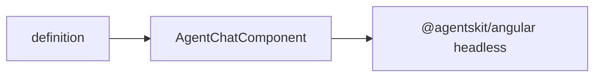

# @agentskit/chat/angular

**Profile:** `concise-package`

Native Angular application shell for AgentsKit Chat. Composes `AgentskitChat` and the standalone components published by `@agentskit/angular`; chat state and lifecycle remain upstream.

## Verified proof

| Surface | Evidence |
|---|---|
| Quick start | [Angular guide](../../docs/getting-started/angular.md) |
| Conformance | [matrix row](../../docs/conformance/matrix.generated.md) |

## Quick start

<!-- readme-command:install-angular -->
```bash
npm install @agentskit/chat @agentskit/angular
```

<!-- readme-example:import-angular -->
```ts
import { AgentChatComponent } from '@agentskit/chat/angular'
```

The standalone component works with Angular 18–21. Use content templates named `container`, `message`, `input`, `thinking`, `confirmation`, and `choiceList` for Angular-native customization.



## Maturity and compatibility

Published in `@agentskit/chat` at `0.3.0` with Angular 18.1–21, RxJS 7, and `@agentskit/angular ^0.4.6`.

- Angular 18.1–21
- Partial-Ivy AOT package test in CI

## Contributing

Package ownership: `packages/angular`. Follow [CONTRIBUTING.md](../../CONTRIBUTING.md).

**Tags:** `agentskit-chat`, `angular`, `chat-ui`

## AgentsKit ecosystem

Renderer binding over [AgentsKit](https://github.com/AgentsKit-io/agentskit) with shared definitions from `@agentskit/chat`.
