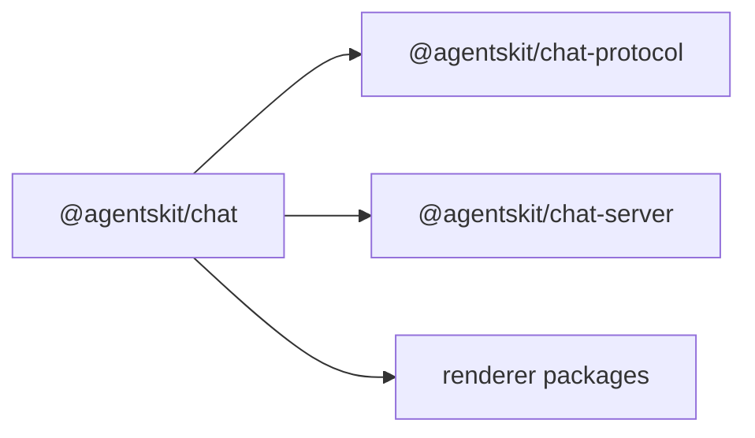

# @agentskit/chat

**Profile:** `major-package`

Framework-neutral application definitions that compile to AgentsKit configuration. Owns typed routes, policy composition, component manifests, session metadata, deterministic answer adapters, and semantic fallback envelopes while the upstream controller keeps lifecycle, memory, and tool execution.

## Verified proof

| Surface | Evidence |
|---|---|
| Standard components | [`catalog.generated.md`](../../docs/components/catalog.generated.md) |
| Deterministic plane | [ADR-0024](../../docs/architecture/adrs/0024-deterministic-answer-plane.md) |
| Upstream adoption | [upstream matrix](../../docs/architecture/upstream-adoption.md) |

`defineChat` preserves the upstream `ChatConfig`; it does not create another runtime.

<!-- readme-command:install-chat -->
```bash
npm install @agentskit/chat @agentskit/core
```

## Quick start

<!-- readme-example:define-chat -->
```ts
import { defineChat } from '@agentskit/chat'

export const definition = defineChat({
  id: 'support',
  chat: { id: 'support', model: 'mock/demo' },
})
```

Use `resumeChatSession(definition, { sessionId, storage })` for cross-client metadata and pass the returned session to any renderer. Custom UI flows through `defineComponentManifest` and `resolveComponentFrame`.




## Maturity and compatibility

Published at `0.2.0` with `@agentskit/core ^1.12.3`, `@agentskit/memory ^0.11.0`, and `@agentskit/statechart ^0.2.0`. See [stability](../../docs/releases/stability.md).

- Node.js 22+
- TypeScript strict mode

## Contributing

Package ownership: `packages/chat`. Follow [CONTRIBUTING.md](../../CONTRIBUTING.md) and query doc-bridge before editing.

**Tags:** `agentskit-chat`, `chat-definitions`, `deterministic-answers`, `typescript`

## AgentsKit ecosystem

Built on [AgentsKit](https://github.com/AgentsKit-io/agentskit). Composes with [Registry](https://registry.agentskit.io), [Playbook](https://playbook.agentskit.io), and [Doc Bridge](https://www.npmjs.com/package/@agentskit/doc-bridge).