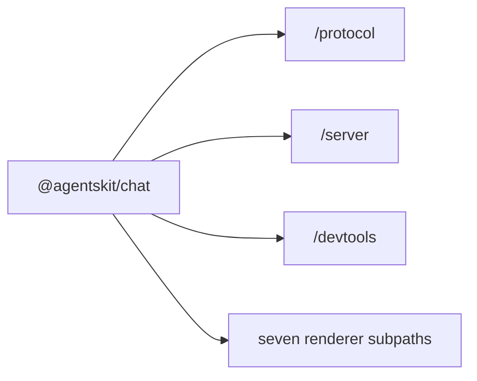

# @agentskit/chat

**Profile:** `major-package`

Framework-neutral application definitions that compile to AgentsKit configuration. Owns typed routes, policy composition, component manifests, session metadata, deterministic answer adapters, and semantic fallback envelopes while the upstream controller keeps lifecycle, memory, and tool execution.

Protocol, server, devtools, and all seven framework renderers ship as subpath exports:

```ts
import { decodeTurnEvent } from '@agentskit/chat/protocol'
import { createChatHandler } from '@agentskit/chat/server'
import { createTraceCapture } from '@agentskit/chat/devtools'
import { AgentChat } from '@agentskit/chat/react'
```

They remain isolated private workspace modules for ownership and testing, while npm consumers install only `@agentskit/chat`. The former standalone package names remain available until the separate deprecation phase.

Actionable choices use `createActionConfirmation`, which delegates validation, canonical confirmation state, approval, denial, and execution to AgentsKit.

## Verified proof

| Surface | Evidence |
|---|---|
| Standard components | [`catalog.generated.md`](../../docs/components/catalog.generated.md) |
| Deterministic plane | [ADR-0024](../../docs/architecture/adrs/0024-deterministic-answer-plane.md) |
| Upstream adoption | [upstream matrix](../../docs/architecture/upstream-adoption.md) |

`defineChat` preserves the upstream `ChatConfig`; it does not create another runtime.

<!-- readme-command:install-chat -->
```bash
npm install @agentskit/chat @agentskit/core
```

## Quick start

<!-- readme-example:define-chat -->
```ts
import { defineChat } from '@agentskit/chat'
import type { AdapterFactory } from '@agentskit/core'

export const createSupportChat = (adapter: AdapterFactory) => defineChat({
  id: 'support',
  chat: { adapter },
})
```

Use `resumeChatSession(definition, { sessionId, storage })` for cross-client metadata and pass the returned session to any renderer. Custom UI flows through `defineComponentManifest` and `resolveComponentFrame`.



```mermaid
flowchart LR
  C["@agentskit/chat"] --> P["/protocol"]
  C --> S["/server"]
  C --> D["/devtools"]
  C --> R["seven renderer subpaths"]
```

## Maturity and compatibility

Published at `0.5.0` with `@agentskit/core ^1.12.3`, `@agentskit/memory ^0.11.0`, and `@agentskit/statechart ^0.2.0`. See [stability](../../docs/releases/stability.md).

- Node.js 22+
- TypeScript strict mode

## Contributing

Package ownership: `packages/chat`. Follow [CONTRIBUTING.md](../../CONTRIBUTING.md) and query doc-bridge before editing.

**Tags:** `agentskit-chat`, `chat-definitions`, `deterministic-answers`, `typescript`

## AgentsKit ecosystem

Built on [AgentsKit](https://github.com/AgentsKit-io/agentskit). Composes with [Registry](https://registry.agentskit.io), [Playbook](https://playbook.agentskit.io), and [Doc Bridge](https://www.npmjs.com/package/@agentskit/doc-bridge).

### Optional PostgreSQL session envelopes

Install `drizzle-orm` and a PostgreSQL driver in the host, then import the optional subpath:

```ts
import { drizzle } from 'drizzle-orm/node-postgres'
import { chatSessionDDL, createDrizzleSessionStorage } from '@agentskit/chat/drizzle-pg'

// pool is the host-owned pg Pool (Node) or connected request Client (Workers).
// Apply chatSessionDDL once in a migration, never on every production request.
const storage = createDrizzleSessionStorage(drizzle(pool), authenticatedTenantId)
```

The adapter stores application envelopes, not messages. Continue using upstream `ChatMemory` for canonical history; a Drizzle ChatMemory backend is pending upstream. `save` returns false for a lost cursor CAS; persistence on the resumed session converts that into `SessionConflictError`, and the handler preserves HTTP 409 `SESSION_CONFLICT`. Keys and every read/update/delete include the trusted tenant ID. Supply tenant identity from authentication, never from an untrusted event.

On Workers connect a `pg.Client` per request (Hyperdrive connection string in production), and call `client.end()` in `waitUntil` after consuming/closing the chat stream. On Node reuse a `pg.Pool` and close it during server shutdown. The adapter imports no Neon or Cloudflare-specific API. Abort is checked before SQL dispatch; in-flight SQL is not cancelled.

The same subpath provides the durable store for confirmations decided in a later request. Apply `chatDecisionDDL` in a migration and pass the store to the handler's `decisions` option:

```ts
import { createDrizzleDecisionStore } from '@agentskit/chat/drizzle-pg'

const decisions = createDrizzleDecisionStore(drizzle(pool), authenticatedTenantId, sessionId)
```

It implements upstream `ToolDecisionStore`: one row per confirmation-required tool call, and a single conditional `UPDATE` as the claim, so concurrent approvals execute the tool once. See [server](../../docs/server.mdx).

Optional RLS defense in depth (configure tenant context with transaction-local `set_config` on the same connection, and use a non-owner role without BYPASSRLS):

```sql
ALTER TABLE agentskit_chat_sessions ENABLE ROW LEVEL SECURITY;
ALTER TABLE agentskit_chat_sessions FORCE ROW LEVEL SECURITY;
CREATE POLICY chat_tenant ON agentskit_chat_sessions
  USING (tenant_id = current_setting('app.tenant_id', true))
  WITH CHECK (tenant_id = current_setting('app.tenant_id', true));
```

See [the reusable local contract](../../tests/storage-pg/README.md) for Postgres 16 and wrangler validation. RLS is optional and is not exercised by that suite.
