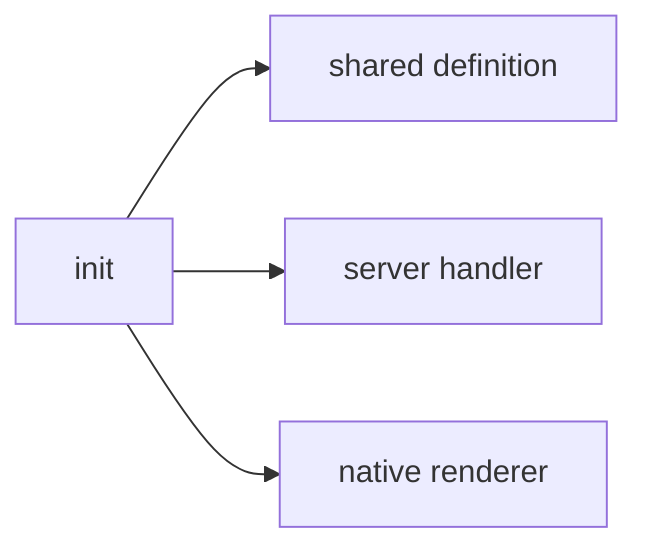

# @agentskit/chat-cli

**Profile:** `major-package`

Framework-aware scaffolding for complete AgentsKit Chat projects. Detects host manifests when unambiguous, prompts only on an interactive TTY, and atomically publishes only to a target path that does not already exist.

## Verified proof

| Surface | Evidence |
|---|---|
| Safe scaffolding | [ADR-0014](../../docs/architecture/adrs/0014-safe-cli-scaffolding.md) |
| Seven renderers | [ADR-0016](../../docs/architecture/adrs/0016-seven-renderer-cli-and-semantic-component-generation.md) |
| Launch verification | [launch checklist](../../docs/releases/launch-checklist.md) |

## Quick start

<!-- readme-command:init-chat -->
```bash
agentskit-chat init my-chat --renderer react --yes
```

<!-- readme-example:renderers -->
```js
export const renderers = ['react', 'react-native', 'ink', 'vue', 'svelte', 'solid', 'angular']
console.log(`Supported renderers: ${renderers.join(', ')}`)
```

Generated projects contain a shared definition, Web-standard server handler, native renderer, test, and architecture README using only published AgentsKit and AgentsKit Chat packages.




## Maturity and compatibility

Published at `0.4.1`. Targets: `react`, `react-native`, `ink`, `vue`, `svelte`, `solid`, and `angular`.

- Node.js 22+
- Never merges, deletes, or overwrites existing project files

## Contributing

Package ownership: `packages/cli`. Follow [CONTRIBUTING.md](../../CONTRIBUTING.md).

**Tags:** `agentskit-chat`, `cli`, `scaffolding`, `developer-experience`

## AgentsKit ecosystem

Entry point for teams adopting AgentsKit Chat alongside [AgentsKit](https://github.com/AgentsKit-io/agentskit), Registry, and Playbook.
