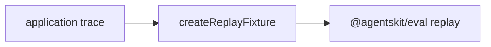

# @agentskit/chat/devtools

**Profile:** `concise-package`

Application trace capture, upstream replay-fixture composition, and semantic renderer parity diagnostics for AgentsKit Chat.

## Verified proof

| Surface | Evidence |
|---|---|
| Replay composition | [ADR-0017](../../docs/architecture/adrs/0017-application-traces-compose-upstream-replay.md) |
| Conformance | [matrix row](../../docs/conformance/matrix.generated.md) |
| Devtools guide | [devtools.md](../../docs/devtools.md) |

This package does not record or replay model calls. Use `createRecordingAdapter` and `createReplayAdapter` from `@agentskit/eval/replay`.

## Quick start

<!-- readme-command:install-devtools -->
```bash
npm install @agentskit/chat @agentskit/eval
```

<!-- readme-example:import-devtools -->
```ts
import { createReplayFixture } from '@agentskit/chat/devtools'
```

Store replay cassettes beside application traces with `createReplayFixture` after upstream eval adapters produce them.



## Maturity and compatibility

Published in `@agentskit/chat` at `0.3.0` with `@agentskit/eval ^0.4.19` where replay composition is used.

- Node.js 22+
- Composes upstream replay; does not fork eval primitives

## Contributing

Package ownership: `packages/devtools`. Follow [CONTRIBUTING.md](../../CONTRIBUTING.md).

**Tags:** `agentskit-chat`, `devtools`, `replay`, `eval`

## AgentsKit ecosystem

Diagnostics layer over [AgentsKit eval](https://github.com/AgentsKit-io/agentskit) for renderer parity and application traces.
