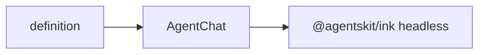

# @agentskit/chat/ink

**Profile:** `concise-package`

Opinionated Ink shell for a framework-neutral AgentsKit Chat definition. Chat state, streaming, keyboard history, cancellation, and terminal primitives come directly from `@agentskit/ink`.

## Verified proof

| Surface | Evidence |
|---|---|
| Quick start | [Ink guide](../../docs/getting-started/ink.md) |
| Conformance | [matrix row](../../docs/conformance/matrix.generated.md) |
| PTY evidence | `apps/example-ink` and `pnpm test:pty` |

## Quick start

<!-- readme-command:install-ink -->
```bash
npm install @agentskit/chat @agentskit/ink
```

<!-- readme-example:import-ink -->
```tsx
import { AgentChat } from '@agentskit/chat/ink'
```

Unsupported visual components should be validated through `parseSemanticFallback` from `@agentskit/chat` and rendered through `SemanticFallback`. The native `ChoiceList` supports Up/Down or a number followed by Enter.



## Maturity and compatibility

Published in `@agentskit/chat` at `0.3.0` with Ink 7.1+, React 18+, and real PTY interaction tests in CI.

- Ink 7.1+
- Terminal keyboard flow and graceful process exit verified

## Contributing

Package ownership: `packages/ink`. Follow [CONTRIBUTING.md](../../CONTRIBUTING.md).

**Tags:** `agentskit-chat`, `ink`, `terminal`, `chat-ui`

## AgentsKit ecosystem

Terminal renderer over [AgentsKit](https://github.com/AgentsKit-io/agentskit) with dedicated proof apps in `apps/example-ink`.
