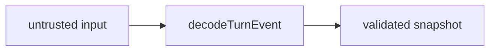

# @agentskit/chat-protocol

**Profile:** `major-package`

Framework-neutral v1 turn events, deterministic answer envelopes, and Ask service contracts for AgentsKit Chat. Transports snapshots of canonical AgentsKit state without implementing a controller, stream reducer, transport, or persistence layer.

## Verified proof

| Surface | Evidence |
|---|---|
| Turn protocol | [v1 guide](../../docs/protocol/v1.md) |
| Deterministic answers | [deterministic guide](../../docs/protocol/deterministic-answers.md) |
| Ask backend | [backend guide](../../docs/backend.md) |

## Quick start

Decode untrusted wire data at every boundary:

<!-- readme-command:install-protocol -->
```bash
npm install @agentskit/chat-protocol
```

<!-- readme-example:decode-turn -->
```ts
import { decodeTurnEvent } from '@agentskit/chat-protocol'

const result = decodeTurnEvent({ unexpected: true })
if (result.ok) throw new Error('expected invalid turn event')
```

For ordered assistant prose plus registered components, use `createAssistantContentEncoder` and decode with `decodeAssistantContent`.




## Maturity and compatibility

Published at `0.2.0`. Wire changes require a new protocol version and explicit decoder path. See [stability](../../docs/releases/stability.md).

- Node.js 22+
- TypeScript strict mode

## Contributing

Package ownership: `packages/protocol`. Follow [CONTRIBUTING.md](../../CONTRIBUTING.md).

**Tags:** `agentskit-chat`, `protocol`, `runtime-validation`, `typescript`

## AgentsKit ecosystem

Consumes AgentsKit state snapshots from [AgentsKit](https://github.com/AgentsKit-io/agentskit). Shared across Registry, Playbook, and Doc Bridge dogfood hosts.