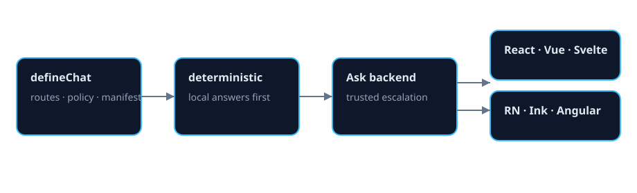
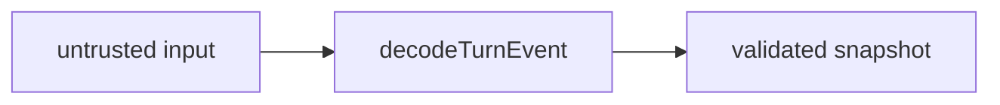

# @agentskit/chat/protocol

**Profile:** `major-package`

Framework-neutral v1 turn events, deterministic answer envelopes, and Ask service contracts for AgentsKit Chat. Transports snapshots of canonical AgentsKit state without implementing a controller, stream reducer, transport, or persistence layer.

## Verified proof

| Surface | Evidence |
|---|---|
| Turn protocol | [v1 guide](../../docs/protocol/v1.md) |
| Deterministic answers | [deterministic guide](../../docs/protocol/deterministic-answers.md) |
| Ask backend | [backend guide](../../docs/backend.md) |

## Quick start

Decode untrusted wire data at every boundary:

<!-- readme-command:install-protocol -->
```bash
npm install @agentskit/chat
```

<!-- readme-example:decode-turn -->
```ts
import { decodeTurnEvent } from '@agentskit/chat/protocol'

const result = decodeTurnEvent({ unexpected: true })
if (result.ok) throw new Error('expected invalid turn event')
```

For ordered assistant prose plus registered components, use `createAssistantContentEncoder` and decode with `decodeAssistantContent`.




```mermaid
flowchart LR
  U["untrusted input"] --> D["decodeTurnEvent"]
  D --> S["validated snapshot"]
```

## Maturity and compatibility

Published in `@agentskit/chat` at `0.5.0`. Wire changes require a new protocol version and explicit decoder path. See [stability](../../docs/releases/stability.md).

- Node.js 22+
- TypeScript strict mode

## Contributing

Package ownership: `packages/protocol`. Follow [CONTRIBUTING.md](../../CONTRIBUTING.md).

**Tags:** `agentskit-chat`, `protocol`, `runtime-validation`, `typescript`

## AgentsKit ecosystem

Consumes AgentsKit state snapshots from [AgentsKit](https://github.com/AgentsKit-io/agentskit). Shared across Registry, Playbook, and Doc Bridge dogfood hosts.

### Referenced input parts (additive v1)

`client.turn.submit.payload.input` also accepts up to 32 parts: `{ type: 'text', text }`
and `{ type: 'file', ref, mimeType, sha256, bytes }`. File objects reject extra fields,
including inline binary/base64. `sha256` is lowercase hex; `bytes` is a positive integer.
The server keeps the 64 KiB JSON request boundary.

A server may advertise `turn-parts-v1` in the first snapshot's optional
`payload.capabilities`; clients must echo it in submit `payload.capabilities` before
sending parts. Existing string submissions need no capability. Schema support alone
is not an advertisement: the current server announces an empty capability list and
returns `TURN_PARTS_UNAVAILABLE` (501) for validated parts, because the published
upstream controller still accepts only strings. Do not send parts until a server
advertises this capability. Protocol version remains 1.
