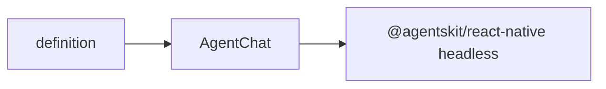

# @agentskit/chat/react-native

**Profile:** `concise-package`

React Native application shell for an AgentsKit Chat definition. Delegates chat state, streaming, cancellation, and native headless components to `@agentskit/react-native`.

## Verified proof

| Surface | Evidence |
|---|---|
| Quick start | [React Native guide](../../docs/getting-started/react-native.md) |
| Conformance | [matrix row](../../docs/conformance/matrix.generated.md) |

## Quick start

<!-- readme-command:install-react-native -->
```bash
npm install @agentskit/chat @agentskit/react-native
```

<!-- readme-example:import-react-native -->
```tsx
import { AgentChatNative } from '@agentskit/chat/react-native'
```

`ChoiceListNative` renders a validated shared frame with native accessibility roles and labels. Use `theme` and `slots` with `toChatNativeStyles` for semantic styling. See [theming and composition](../../docs/theming-and-composition.md).



## Maturity and compatibility

Published in `@agentskit/chat` at `0.4.1` with React 18+, React Native, and Expo web/iOS bundle evidence in release workflows.

- React 18+
- Native accessibility roles in CI

## Contributing

Package ownership: `packages/react-native`. Follow [CONTRIBUTING.md](../../CONTRIBUTING.md).

**Tags:** `agentskit-chat`, `react-native`, `expo`, `chat-ui`

## AgentsKit ecosystem

Mobile renderer over [AgentsKit](https://github.com/AgentsKit-io/agentskit) with dedicated proof apps in `apps/example-react-native`.
