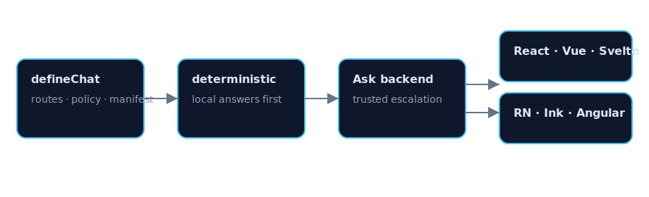
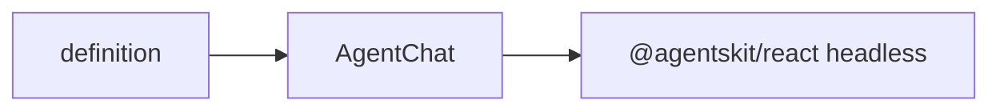

# @agentskit/chat-react

**Profile:** `major-package`

Accessible React application shell over `@agentskit/react`. Chat state, streaming, cancellation, and headless components remain upstream; this package owns semantic theming, native slots, and the shared `ChoiceList` renderer.

## Verified proof

| Surface | Evidence |
|---|---|
| DOM parity | [dom renderer parity](../../docs/examples/dom-renderer-parity.md) |
| Conformance | [matrix row](../../docs/conformance/matrix.generated.md) |
| Quick start | [React guide](../../docs/getting-started/react.md) |

## Quick start

<!-- readme-command:install-react -->
```bash
npm install @agentskit/chat-react @agentskit/chat @agentskit/react
```

<!-- readme-example:agent-chat -->
```tsx
import { AgentChat } from '@agentskit/chat-react'
import type { ChatDefinition } from '@agentskit/chat'

export const App = ({ definition }: { readonly definition: ChatDefinition }) =>
  <AgentChat definition={definition} placeholder="Ask a question" />
```

Use `theme` for semantic tokens and `slots` for native React composition. `toChatCssVariables` exposes the upstream CSS-variable mapping. See [theming and composition](../../docs/theming-and-composition.md).





## Maturity and compatibility

Published at `0.2.0` with React 18+, `@agentskit/react ^0.7.1`, and Chromium E2E evidence in CI.

- React 18+
- TypeScript strict mode

## Contributing

Package ownership: `packages/react`. Follow [CONTRIBUTING.md](../../CONTRIBUTING.md).

**Tags:** `agentskit-chat`, `react`, `accessibility`, `chat-ui`

## AgentsKit ecosystem

Primary web renderer for Registry and Playbook dogfood on [AgentsKit](https://github.com/AgentsKit-io/agentskit).
