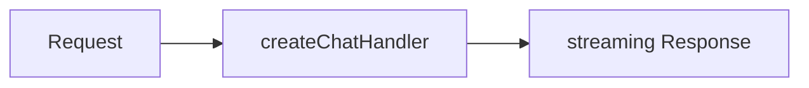

# @agentskit/chat/server

**Profile:** `major-package`

Web-standard request handlers for AgentsKit Chat definitions. Composes the canonical AgentsKit controller and memory with AgentsKit Chat protocol and session contracts.

## Verified proof

| Surface | Evidence |
|---|---|
| Chat handler | [ADR-0012](../../docs/architecture/adrs/0012-web-standard-snapshot-handler.md) |
| Ask vertical | [ADR-0026](../../docs/architecture/adrs/0026-trusted-ask-backend-vertical.md) |
| Deployment recipes | [deployment guide](../../docs/deployment.md) |

## Quick start

<!-- readme-command:install-server -->
```bash
npm install @agentskit/chat @agentskit/core
```

<!-- readme-example:chat-handler -->
```ts
import { createChatHandler } from '@agentskit/chat/server'
import type { ChatHandlerOptions } from '@agentskit/chat/server'
import type { ChatDefinition, SessionStorage } from '@agentskit/chat'

type TenantContext = { readonly tenantId: string }
type TenantHandlerOptions = {
  readonly authenticate: NonNullable<ChatHandlerOptions<TenantContext>['authenticate']>
  readonly definitionFor: (tenantId: string) => ChatDefinition
  readonly storageFor: (tenantId: string) => SessionStorage
}

export const createTenantHandler = (options: TenantHandlerOptions) => createChatHandler<TenantContext>({
  authenticate: options.authenticate,
  resolveDefinition: context => options.definitionFor(context!.tenantId),
  sessionStorage: context => options.storageFor(context!.tenantId),
})
```

The returned function accepts a standard `Request` and returns a streaming `Response`. Semantic escalations use `createAskServiceHandler` with trusted site resolution.




## Maturity and compatibility

Published in `@agentskit/chat` at `0.4.1` for Next.js, Hono, Express, and Cloudflare Worker recipes documented in [deployment.md](../../docs/deployment.md).

- Node.js 22+
- Web-standard `Request` / `Response`

## Contributing

Package ownership: `packages/server`. Follow [CONTRIBUTING.md](../../CONTRIBUTING.md).

**Tags:** `agentskit-chat`, `server`, `web-standard`, `streaming`

## AgentsKit ecosystem

Mounts the same factories in Registry, Playbook, and self-hosted deployments on top of [AgentsKit](https://github.com/AgentsKit-io/agentskit).
