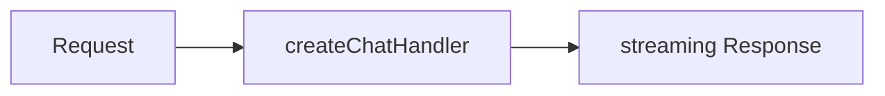

# @agentskit/chat/server

**Profile:** `major-package`

Web-standard request handlers for AgentsKit Chat definitions. Composes the canonical AgentsKit controller and memory with AgentsKit Chat protocol and session contracts.

## Verified proof

| Surface | Evidence |
|---|---|
| Chat handler | [ADR-0012](../../docs/architecture/adrs/0012-web-standard-snapshot-handler.md) |
| Ask vertical | [ADR-0026](../../docs/architecture/adrs/0026-trusted-ask-backend-vertical.md) |
| Deployment recipes | [deployment guide](../../docs/deployment.mdx) |

## Quick start

<!-- readme-command:install-server -->
```bash
npm install @agentskit/chat @agentskit/core
```

<!-- readme-example:chat-handler -->
```ts
import { createChatHandler } from '@agentskit/chat/server'
import type { ChatHandlerOptions } from '@agentskit/chat/server'
import type { ChatDefinition, SessionStorage } from '@agentskit/chat'

type TenantContext = { readonly tenantId: string }
type TenantHandlerOptions = {
  readonly authenticate: NonNullable<ChatHandlerOptions<TenantContext>['authenticate']>
  readonly definitionFor: (tenantId: string) => ChatDefinition
  readonly storageFor: (tenantId: string) => SessionStorage
}

export const createTenantHandler = (options: TenantHandlerOptions) => createChatHandler<TenantContext>({
  authenticate: options.authenticate,
  resolveDefinition: context => options.definitionFor(context!.tenantId),
  sessionStorage: context => options.storageFor(context!.tenantId),
})
```

The returned function accepts a standard `Request` and returns a streaming `Response`. Semantic escalations use `createAskServiceHandler` with trusted site resolution.

The existing 64 KiB request limit is enforced by the published `@agentskit/net` JSON reader, with the same safe 400/413 diagnostics. The request body stream is connected to the combined request/deadline signal so timeout and host cancellation stop body reads. Callback factories use the published `@agentskit/net@0.2.0` `withTimeout` helper with their existing configured deadlines and the parent request signal. This ends the handler's wait when a callback ignores its signal, but arbitrary callback work cannot be forcibly stopped; callbacks should honor the signal to cancel fetches and other cooperative work.



```mermaid
flowchart LR
  R["Request"] --> H["createChatHandler"]
  H --> S["streaming Response"]
```

## Maturity and compatibility

Published in `@agentskit/chat` at `0.5.0` for Next.js, Hono, Express, and Cloudflare Worker recipes documented in [deployment.mdx](../../docs/deployment.mdx).

- Node.js 22+
- Web-standard `Request` / `Response`

## Contributing

Package ownership: `packages/server`. Follow [CONTRIBUTING.md](../../CONTRIBUTING.md).

**Tags:** `agentskit-chat`, `server`, `web-standard`, `streaming`

## AgentsKit ecosystem

Mounts the same factories in Registry, Playbook, and self-hosted deployments on top of [AgentsKit](https://github.com/AgentsKit-io/agentskit).

### Optional reference uploads

Mount `createUploadHandler` at `POST /uploads`. Configure a `BlobStore`, `maxBytes`,
allowed `mimeTypes`, and mandatory host `authorize(request, sessionId, signal)`.
Authorization must authenticate the caller and authorize that session, returning a
trusted `tenantId`. The request is JSON metadata only: `{ sessionId, bytes, mimeType }`.
The 201 response contains `{ ref, url, headers, expiresIn }`. PUT the file directly to
storage using the signed MIME and exact byte count. Browsers set Content-Length
implicitly; do not attempt to override that forbidden browser header.

`createS3BlobStore` uses SigV4 through aws4fetch and path-style endpoints for R2,
MinIO and S3. Supply credentials from your host's secret channel. URLs default to
300 seconds and are capped at 600. Never log signed URLs or persist them as message
content. Scope keys are `tenantId/sessionId/random-uuid`; identifiers follow the
protocol's safe identifier rules. Configure bucket CORS for your browser origin and
PUT/Content-Type, and lifecycle cleanup for abandoned uploads in the host infrastructure.

The chat handler's optional `uploads` policy additionally requires
`tenantId(context, sessionId, signal)`, which must authorize access to the session.
Reference validation rejects cross-tenant/session keys (403), disallowed size/type
(413/415), missing objects or metadata/checksum mismatches (422). SHA-256 checks read
at most the declared upload size and buffer it within `maxBytes`; choose a conservative
limit. The store's short `presignGet` is available for future upstream composition.

Parts delivery remains disabled: valid references receive 501
`TURN_PARTS_UNAVAILABLE` until a supported, published AgentsKit controller accepts
parts. No controller wrapper, private upstream import or text flattening is used.
See ADR-0035 and the CH-D report for local storage/workerd evidence and remaining gates.

Turn cost policies reserve with server-generated IDs. Once an adapter call starts,
cleanup commits reported usage or the reserved estimate when usage is unknown,
including cancellation, timeout and provider failures. Pre-dispatch failures release
the hold. Decision stores reject reused IDs from a different or settled proposal.
