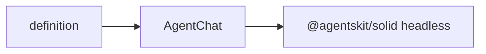

# @agentskit/chat-solid

**Profile:** `concise-package`

Solid application shell for AgentsKit Chat. Composes `useChat` and the headless components from `@agentskit/solid`; chat state, streaming, and lifecycle remain upstream.

## Verified proof

| Surface | Evidence |
|---|---|
| Quick start | [Solid guide](../../docs/getting-started/solid.md) |
| Conformance | [matrix row](../../docs/conformance/matrix.generated.md) |

## Quick start

<!-- readme-command:install-solid -->
```bash
npm install @agentskit/chat-solid @agentskit/chat @agentskit/solid
```

<!-- readme-example:import-solid -->
```ts
import { AgentChat } from '@agentskit/chat-solid'
```

Customization uses typed Solid render props: `container`, `message`, `input`, `thinking`, `confirmation`, and `choiceList`.



## Maturity and compatibility

Published at `0.2.0` with Solid 1.9+ and `@agentskit/solid ^0.4.4`.

- Solid 1.9+
- TypeScript strict mode

## Contributing

Package ownership: `packages/solid`. Follow [CONTRIBUTING.md](../../CONTRIBUTING.md).

**Tags:** `agentskit-chat`, `solid`, `chat-ui`

## AgentsKit ecosystem

Renderer binding over [AgentsKit](https://github.com/AgentsKit-io/agentskit) with shared definitions from `@agentskit/chat`.