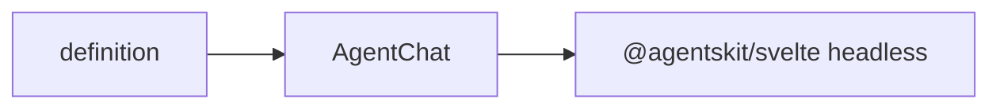

# @agentskit/chat/svelte

**Profile:** `concise-package`

Svelte 5 application shell for AgentsKit Chat. Composes `createChatStore` and the headless components from `@agentskit/svelte`; chat state and lifecycle remain upstream.

## Verified proof

| Surface | Evidence |
|---|---|
| Quick start | [Svelte guide](../../docs/getting-started/svelte.md) |
| Conformance | [matrix row](../../docs/conformance/matrix.generated.md) |

## Quick start

<!-- readme-command:install-svelte -->
```bash
npm install @agentskit/chat @agentskit/svelte
```

<!-- readme-example:import-svelte -->
```ts
import { AgentChat } from '@agentskit/chat/svelte'
```

Customization uses typed Svelte snippets: `container`, `message`, `input`, `thinking`, `confirmation`, and `choiceList`.



## Maturity and compatibility

Published in `@agentskit/chat` at `0.4.1` with Svelte 5+ and `@agentskit/svelte ^0.4.4`.

- Svelte 5+
- SSR evidence in CI

## Contributing

Package ownership: `packages/svelte`. Follow [CONTRIBUTING.md](../../CONTRIBUTING.md).

**Tags:** `agentskit-chat`, `svelte`, `chat-ui`

## AgentsKit ecosystem

Renderer binding over [AgentsKit](https://github.com/AgentsKit-io/agentskit) with shared definitions from `@agentskit/chat`.
