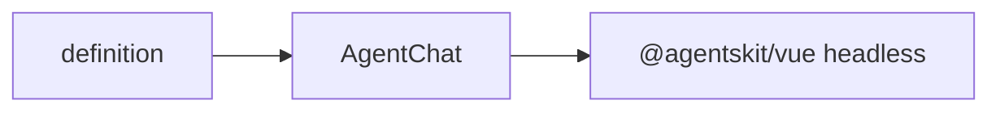

# @agentskit/chat/vue

**Profile:** `concise-package`

Native Vue 3 application shell for AgentsKit Chat. Composes `useChat`, `ChatRoot`, and the headless components published by `@agentskit/vue`; chat state and lifecycle remain upstream.

## Verified proof

| Surface | Evidence |
|---|---|
| Quick start | [Vue guide](../../docs/getting-started/vue.mdx) |
| Conformance | [matrix row](../../docs/conformance/matrix.generated.md) |

## Quick start

<!-- readme-command:install-vue -->
```bash
npm install @agentskit/chat @agentskit/vue
```

<!-- readme-example:import-vue -->
```ts
import { AgentChat } from '@agentskit/chat/vue'
```

Use the named scoped slots `container`, `message`, `input`, `thinking`, `confirmation`, and `choiceList` for Vue-native customization.



## Maturity and compatibility

Published in `@agentskit/chat` at `0.4.1` with Vue 3.4+ and `@agentskit/vue ^0.4.4`.

- Vue 3.4+
- TypeScript strict mode

## Contributing

Package ownership: `packages/vue`. Follow [CONTRIBUTING.md](../../CONTRIBUTING.md).

**Tags:** `agentskit-chat`, `vue`, `chat-ui`

## AgentsKit ecosystem

Renderer binding over [AgentsKit](https://github.com/AgentsKit-io/agentskit) with shared definitions from `@agentskit/chat`.
